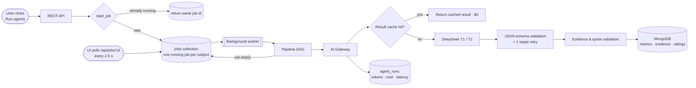
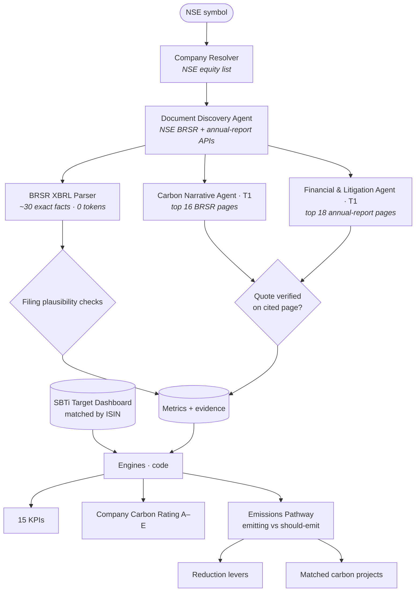
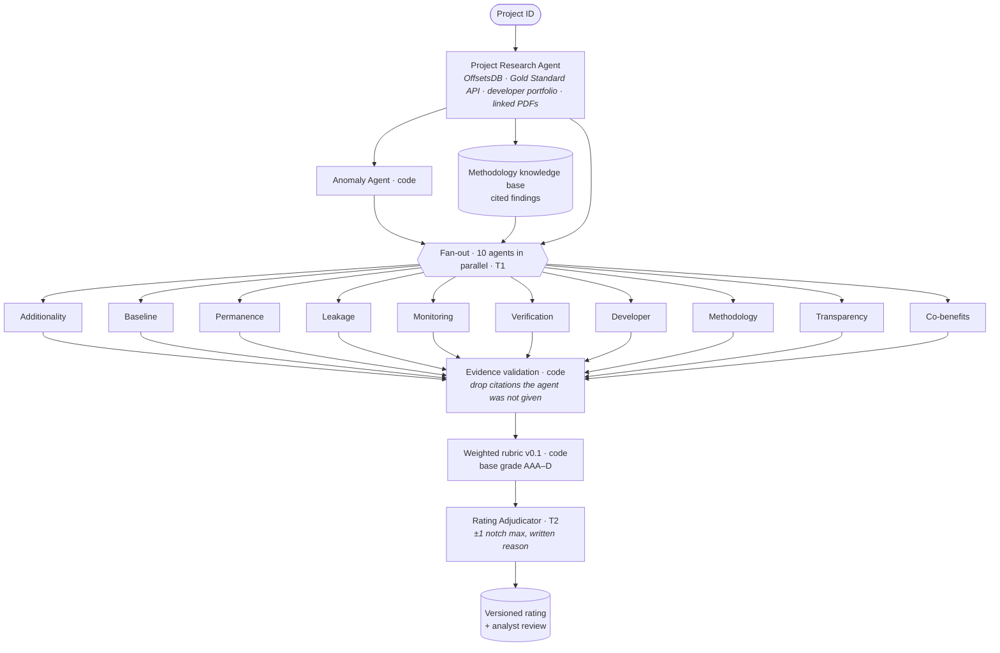
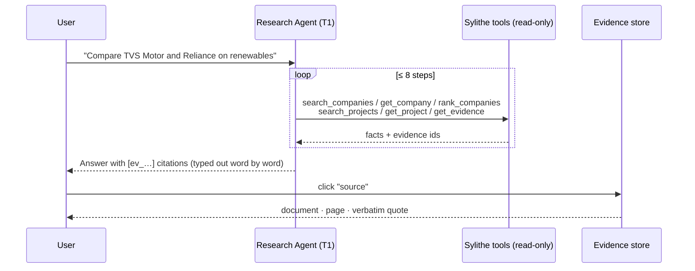
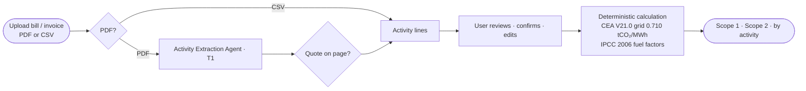
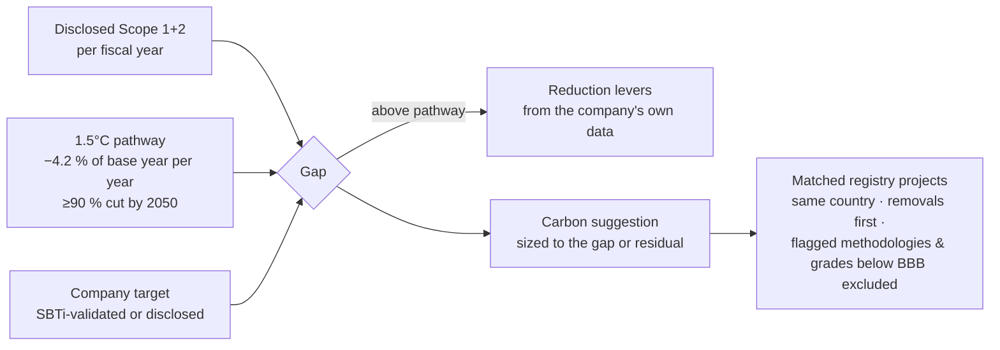
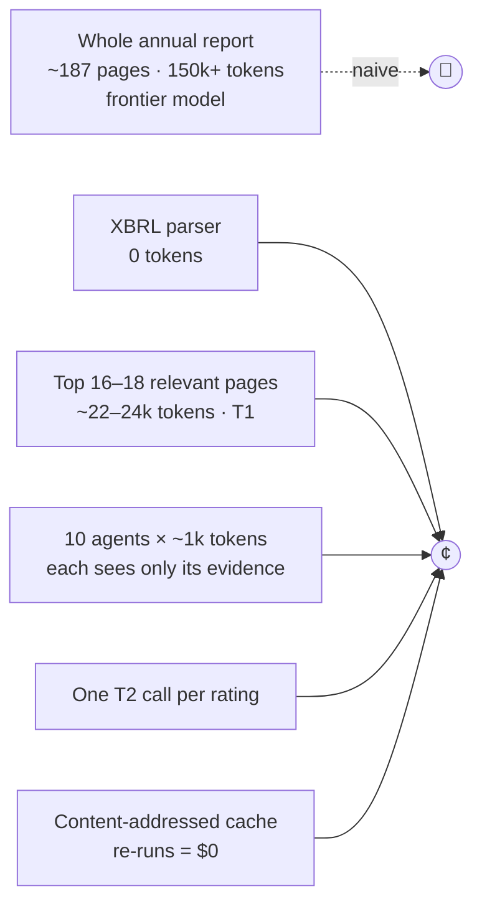
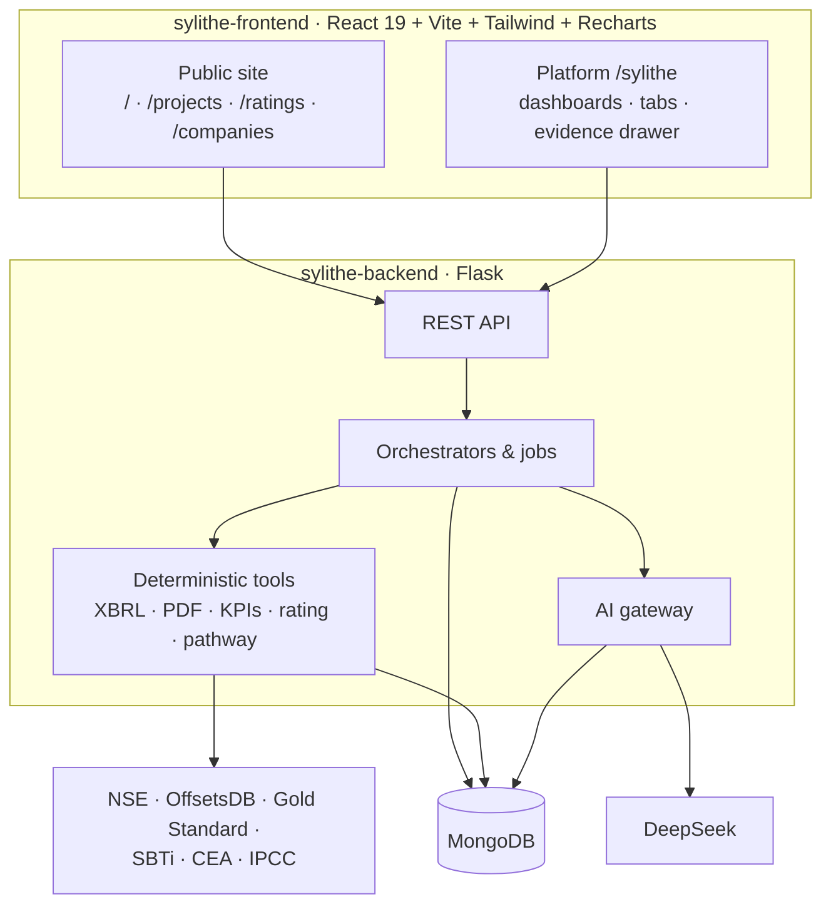

<div align="center">

# Sylithe

### Evidence-backed carbon intelligence — powered by AI research agents

**Measure companies from their own filings · Rate carbon projects across 7 registries · Tell every company how much it should emit — and prove every number**


</div>

---

## Table of contents

1. [The AI agents](#1-the-ai-agents)
2. [Agent orchestration & workflows](#2-agent-orchestration--workflows)
3. [What Sylithe produces](#3-what-sylithe-produces)
4. [Company analysis — BRSR, annual report, CSR](#4-company-analysis--brsr-annual-report-csr)
5. [Emissions pathway — emitting vs should-emit](#5-emissions-pathway--emitting-vs-should-emit)
6. [Carbon project rating](#6-carbon-project-rating)
7. [Results on real companies](#7-results-on-real-companies)
8. [Cost — how we keep it to cents](#8-cost--how-we-keep-it-to-cents)
9. [Speed — how we keep latency low](#9-speed--how-we-keep-latency-low)
10. [Accuracy & anti-hallucination](#10-accuracy--anti-hallucination)
11. [Research foundation](#11-research-foundation)
12. [Architecture & repository layout](#12-architecture--repository-layout)
13. [Getting started](#13-getting-started)
14. [API reference](#14-api-reference)
15. [Roadmap & limitations](#15-roadmap--limitations)

---

## 1. The AI agents

Sylithe is built around **small, specialised agents inside code-controlled workflows** — not one giant chatbot.
Numbers come from parsers, registries and formulas; agents read narrative text, assess evidence and explain. Every
agent output is validated by code before it is stored.

| # | Agent | Kind | Model tier | Job |
|---|---|---|---|---|
| 1 | **Company Resolver** | tool | — | Matches a name or symbol to the NSE listing (2,585 companies, ISIN) |
| 2 | **Document Discovery Agent** | tool | — | Finds the company's BRSR (PDF + XBRL) and annual reports on NSE |
| 3 | **BRSR XBRL Parser** | tool | — | Reads ~30 exact tagged facts (Scope 1/2/3, energy, water, waste, revenue) with plausibility checks — **0 tokens** |
| 4 | **Carbon Narrative Agent** | LLM | T1 | Reads the most relevant BRSR pages → climate targets, carbon credits, Scope 3 categories, transition actions |
| 5 | **Financial & Litigation Agent** | LLM | T1 | Reads the most relevant annual-report pages → revenue, EBITDA, capex, **CSR spend**, environmental capex, legal & environmental matters |
| 6 | **Project Research Agent** | tool | — | Gathers registry facts, Gold Standard record, developer portfolio, methodology knowledge, linked PDFs |
| 7 | **Anomaly Agent** | tool | — | Detects issuance spikes, vintage concentration, late issuance, issuance above registry estimate, low retirement |
| 8–17 | **10 Dimension Agents** | LLM | T1 | Additionality · Baseline · Permanence · Leakage · Monitoring · Verification · Developer · Methodology · Transparency · Co-benefits |
| 18 | **Rating Adjudicator** | LLM | T2 | Reviews all dimensions; may move the rubric grade by **at most one notch** with a written reason; writes the summary |
| 19 | **Research Agent** | LLM + tools | T1 | Answers questions using six read-only Sylithe tools, citing evidence ids |
| 20 | **Activity Extraction Agent** | LLM | T1 | Reads a company's own bills/invoices (calculator uploads) → activity quantities with verified quotes |

**T1** = `deepseek-flash` (fast, low-cost) · **T2** = `deepseek-v4-pro` (reasoning, used once per rating).

### Agent contract

Every LLM agent returns schema-validated JSON and may only cite evidence it was given:

```json
{
  "score": 0-100,
  "risk": "low | medium | high | unknown",
  "reason": "≤ 3 sentences",
  "evidence": [{ "evidence_id": "ev_3f9a…", "supports": "what this evidence shows" }],
  "data_gaps": ["what was looked for and not found"],
  "label": "Reported | Calculated | Inference | Model estimate | Data not found",
  "reasoning_summary": "how the evidence was weighed"
}
```

---

## 2. Agent orchestration & workflows

### 2.1 The orchestrator



* **Workflow, not free-roaming agents.** Each pipeline is a fixed DAG; LLMs are called only at defined nodes.
* **Live progress.** Every step writes to the job record; the UI shows each agent finishing with its running cost.
* **Resilient.** One running job per subject (double clicks attach to it), 180 s download deadlines, stalled jobs expire.

### 2.2 Company research workflow (Module 1)



Only **two LLM calls** per company.

### 2.3 Project rating workflow (Module 2)



### 2.4 Research Agent — tool loop



### 2.5 Carbon Calculator (company users)



---

## 3. What Sylithe produces

| Product | For | Output |
|---|---|---|
| **Company Carbon Intelligence** | Sustainability, ESG & finance teams, investors | Scope 1/2/3, energy, water, waste, CSR & financial context, targets, climate-legal exposure, 15 KPIs, rating A–E, emissions pathway, levers, matched projects |
| **Carbon Project Rating** | Credit buyers, investors, analysts | AAA–D rating across 11 dimensions with evidence, anomaly alerts, comparison, analyst overrides, rating history |
| **Research Agent** | Everyone | Cited natural-language answers across companies and projects |
| **Carbon Calculator** | Companies measuring their own footprint | Scope 1/2 from their own bills — the only place users upload files |

Public website: home · project marketplace · public project pages · rating methodology · company intelligence ·
due-diligence process · about. Platform (login): `/sylithe`.

---

## 4. Company analysis — BRSR, annual report, CSR

| Source | Section | What Sylithe extracts |
|---|---|---|
| **BRSR XBRL** (SEBI taxonomy) | Principle 6 tagged facts | Scope 1, 2, 3 · intensity per ₹ revenue · total & renewable energy · electricity · water withdrawal/consumption · waste generated/recovered · revenue · reporting boundary · GHG assurance |
| **BRSR PDF** | Principle 6 narrative & leadership indicators | Net-zero / reduction / renewable targets (base year, target year, SBTi status) · carbon credits · Scope 3 categories · transition actions |
| **Annual report** | Financial statements, CSR annexure, notes | Revenue · EBITDA · PAT · capex · **CSR spend** · environmental capex · legal & professional fees · environmental penalties & proceedings · explicitly climate-related litigation |
| **SBTi Target Dashboard** | — | Validated / committed / removed status · target wording · net-zero status |

**Company Carbon Rating v0.1 (A–E)** — disclosure quality · emissions trajectory · intensity trend · renewable transition ·
target credibility · carbon-credit use · climate-legal exposure · data confidence. The grade is withheld when fewer than
five dimensions can be scored.

---

## 5. Emissions pathway — emitting vs should-emit



Every company page shows a chart and a year-by-year table of **what it emits, what it should emit, its own target and
the gap**, the reduction levers ranked from its own data (renewable share, Scope 1 share, trend, Scope 3, SBTi status), and
matched carbon projects with their cumulative coverage. Credits are suggested only for residual emissions — they never
count toward reduction targets.

---

## 6. Carbon project rating

| Dimension | Weight | Dimension | Weight |
|---|---:|---|---:|
| Additionality | 20 | Verification | 10 |
| Baseline integrity | 15 | Developer | 5 |
| Permanence* | 10 | Methodology | 10 |
| Leakage | 5 | Transparency | 5 |
| Monitoring | 10 | Co-benefits | 5 |
| | | Data quality | 5 |

\* weight 0 where the category stores no carbon (e.g. renewables, cookstoves).
Grades: AAA ≥ 85 · AA ≥ 75 · A ≥ 65 · BBB ≥ 55 · BB ≥ 45 · B ≥ 35 · C ≥ 25 · D. Ratings with no project documents are
**provisional**. Every rating stores methodology, prompt, knowledge-base and model versions.

---

## 7. Results on real companies

Latest filings (BRSR FY2025-26), produced end-to-end by the agents:

| | Reliance Industries | TVS Motor | Tata Consultancy Services | Wipro |
|---|---:|---:|---:|---:|
| Scope 1+2 (tCO₂e) | 38,268,422 (+0.9 %) | 23,776 (+2.2 %) | 76,602 (+0.7 %) | 15,724 (−50.0 %) |
| Scope 3 | not disclosed | not disclosed | 573,872 | 170,928 |
| Renewable share | 1.1 % | 97.1 % | 79.0 % | 94 % of electricity¹ |
| CSR spend | ₹1,223 cr | ₹56 cr | ₹1,017 cr | ₹227 cr |
| SBTi | not on dashboard | commitment removed | validated 1.5°C | validated 1.5°C, net zero FY2040 |
| vs 1.5°C path | **+1.93 Mt above** | +1,500 t above | +3,704 t above | **−14,416 t (on track)** |
| Top gap | No SBTi, no base year for 2035 net zero, no Scope 3, renewables 1.1 % | SBTi lapsed, Scope 1 +14 %, no quantified target | Scope 1+2 still rising | Base-year tonnes not in filings |
| **Rating** | **C** | **B** | **B** | **A** |

¹ from Wipro's BRSR narrative; its XBRL energy total failed Sylithe's consistency check.
Full analysis per company: [`sylithe-docs/SYLITHE_PROJECT_GUIDE.md`](sylithe-docs/SYLITHE_PROJECT_GUIDE.md#5-company-results).

---

## 8. Cost — how we keep it to cents

| Job | Measured AI cost |
|---|---|
| Full company research | **$0.009 – $0.015** |
| Full project rating (10 agents + adjudicator) | **$0.007 – $0.017** |
| Research-agent answer | **≈ $0.002** |
| Unchanged re-run | **$0.00** |

At scale: **1,000 companies ≈ $12 · all 11,659 registry projects ≈ $120** (LLM cost).



1. **No LLM where code can answer** — XBRL, registry maths, KPI/rating/pathway formulas.
2. **Page selection** — keyword-scored pages instead of whole documents (~85 % fewer input tokens).
3. **Tiered models** — fast T1 for extraction and dimensions; the reasoning model once per rating.
4. **Tiny per-agent contexts** — each dimension agent sees ~1k tokens of its own evidence.
5. **Result cache** keyed by agent + prompt version + model + input; **parsed-PDF cache** by URL.
6. **Methodology-level reuse** — methodology findings computed once, shared by every project on that methodology.
7. **Low reasoning effort, strict schemas, one repair retry** — fewer output tokens, no retry loops.
8. **Off-peak awareness & telemetry** — every call logs tokens, cost and cache hits; bulk runs can target off-peak pricing.

---

## 9. Speed — how we keep latency low

| Job | Measured time |
|---|---|
| Company research (download → parse → 2 agents → engines) | **43 – 75 s** |
| Project rating | **12 – 62 s** |
| Research-agent answer | **≈ 8 s** |
| Cached re-run | **< 1 s** |

1. **Parallel fan-out** — 10 dimension agents run concurrently: latency ≈ slowest agent (~5–8 s), not the sum (~50 s).
2. **Deterministic steps first** — resolver, discovery and XBRL finish in seconds and appear immediately.
3. **Background jobs with live progress** — the request returns instantly; each step streams to the UI.
4. **Small prompts** — faster time-to-first-token and generation.
5. **Caches everywhere** — AI results, parsed PDFs, NSE list (7 days), registry & SBTi data (weekly).
6. **Hard deadlines & retries** — 180 s per download, timeouts and back-off on LLM calls.
7. **Progressive rendering** — research answers type out word by word.

---

## 10. Accuracy & anti-hallucination

* **Quote verification** — every AI-extracted value carries a verbatim quote that code finds on the cited page.
* **Citation validation** — agents can only cite evidence ids they were given; others are removed and counted.
* **Filing plausibility checks** — issues caught in live filings: revenue tagged in crores in an INR field; per-rupee
  intensities ~10⁷× too large; energy totals inconsistent with Scope 1+2 (MJ entered as GJ); Scope 3 tagged 0; waste
  recovered > generated. Failing values are kept for audit, flagged, and excluded.
* **Consistent Scope 2 basis** across years · **legal-cost guard** (no climate attribution without explicit text) ·
  **documents treated as untrusted data** · **versioned ratings** · **human review with the AI assessment preserved**.
* Every value is labelled **Reported · Calculated · Estimated · Inference · Data not found** — gaps are never filled silently.

---

## 11. Research foundation

| Topic | Finding used | Source |
|---|---|---|
| 1.5°C pathway | Minimum 4.2 % linear annual reduction of Scope 1+2; net zero ≥90 % by 2050 | [SBTi criteria](https://sciencebasedtargets.org/resources/files/SBTi-criteria.pdf) · [Net-Zero Standard](https://sciencebasedtargets.org/resources/files/Net-Zero-Standard.pdf) |
| Company targets | Validation status of 15,703 companies | [SBTi Target Dashboard](https://sciencebasedtargets.org/target-dashboard) |
| Renewable-energy credits | Current RE methodologies (e.g. ACM0002, AMS-I.D) not CCP-labelled | [ICVCM](https://icvcm.org/carbon-credits-from-current-renewable-energy-methodologies-will-not-receive-high-integrity-ccp-label/) |
| Cookstove credits | Sample over-credited ~9.2×; metered methodology ~1.5× | [Nature Sustainability 2024](https://www.nature.com/articles/s41893-023-01259-6) |
| REDD+ baselines | Ex-ante baselines tended to be overstated | [Science 2023](https://www.science.org/doi/10.1126/science.ade3535) |
| CCP-approved methodologies | VM0048 (REDD+), VM0047 (ARR) | [ICVCM](https://icvcm.org/integrity-council-approves-three-redd-methodologies/) · [Verra](https://verra.org/icvcm-approves-updated-version-of-verras-afforestation-reforestation-and-revegetation-methodology/) |
| Indian grid factor | 0.710 tCO₂/MWh, FY2024-25 | [CEA CO₂ Baseline Database V21.0](https://cea.nic.in/wp-content/uploads/baseline/2025/12/User_Guide_V_21.0.pdf) |
| Registry data | 7 registries harmonised, projects + transactions | [CarbonPlan OffsetsDB](https://carbonplan.org/research/offsets-db) |
| BRSR structured data | BRSR filed in PDF + XBRL | [NSE circular](https://nsearchives.nseindia.com/web/sites/default/files/inline-files/NSE_Circular_10052024_1.pdf) |

More: [`sylithe-docs/research/`](sylithe-docs/research) · [`sylithe-docs/methodology/`](sylithe-docs/methodology).

---

## 12. Architecture & repository layout



```text
vertex-sylithe/
├── sylithe-backend/        Flask API, agents, pipelines, engines        (git submodule)
│   ├── routes/             companies · project_intel · research · calculator · auth …
│   └── services/           ai · company_agents · brsr_xbrl · nse · company_rating · company_pathway ·
│                           sbti · project_rating · offsetsdb · methodology_kb · documents · evidence · jobs
├── sylithe-frontend/       React app                                    (git submodule)
│   └── src/
│       ├── site/           public website
│       └── sylithe/        platform: Overview · Companies · Pathway · Projects · Compare · Research · Calculator
└── sylithe-docs/
    ├── SYLITHE_PROJECT_GUIDE.md   full project guide
    ├── methodology/               company & project rating methodologies
    ├── architecture/              agent architecture, implementation notes
    └── research/                  market, data-source and cost research
```

---

## 13. Getting started

**Prerequisites:** Python 3.11+, Node 20+, MongoDB, a DeepSeek API key.

```bash
git clone --recurse-submodules https://github.com/chhelu123/vertex-sylithe.git
cd vertex-sylithe
```

**Backend**

```bash
cd sylithe-backend
python3 -m venv .venv && .venv/bin/pip install -r requirements.txt
cp .env.example .env        # set MONGO_URI, JWT_SECRET, DEEPSEEK_API_KEY
.venv/bin/python app.py     # http://localhost:5001
```

**Frontend**

```bash
cd sylithe-frontend
npm install
VITE_API_URL=http://localhost:5001 npm run dev   # http://localhost:5173
```

**First run:** sign in as an admin → **Project Ratings → Load registry data** (OffsetsDB, ~10 s). SBTi data loads
automatically on the first company analysis. Then open **Company Intelligence** and run the agents on any NSE company.

| Variable | Purpose |
|---|---|
| `MONGO_URI` | MongoDB connection |
| `JWT_SECRET` | Auth token signing |
| `DEEPSEEK_API_KEY` | AI agents |
| `AI_T1_MODEL` / `AI_T2_MODEL` | Model tiers (default `deepseek-flash` / `deepseek-v4-pro`) |

---

## 14. API reference

| Area | Endpoints |
|---|---|
| Companies | `GET /api/companies?q=` · `POST /api/companies/research` · `GET /api/companies/:slug` · `/metrics` · `/ratings` |
| Projects | `GET /api/intel/projects` · `/facets` · `GET /api/intel/projects/:id` · `POST …/rate` · `POST …/documents` · `GET /api/intel/compare?ids=` · `POST /api/intel/ratings/:id/review` |
| Registry | `GET /api/intel/registry/meta` · `POST /api/intel/registry/refresh` |
| Research | `POST /api/research/ask` · `GET /api/research/sessions[/:id]` |
| Calculator | `GET/POST /api/calculator/inventories` · `POST …/:id/upload` · `POST …/:id/lines` |
| Shared | `GET /api/overview` · `GET /api/jobs/:id` · `GET /api/evidence/:id` · `GET /api/intel/methodology` · `GET /api/kpi-definitions` |

---

## 15. Roadmap & limitations

- [x] Company intelligence from BRSR XBRL + PDFs + annual reports
- [x] Explainable project ratings across 7 registries
- [x] Emissions pathway, SBTi integration, reduction levers, matched carbon projects
- [x] Research Agent with cited answers · Carbon Calculator
- [ ] Automatic retrieval of project PDDs / monitoring reports (currently analyst-linked)
- [ ] Sector benchmarks for intensity levels
- [ ] OCR for scanned PDFs
- [ ] Coverage beyond NSE-listed companies
- [ ] Land intelligence (LULC, baselines, canopy) — Module 3

> Sylithe ratings are analytical assessments based on available evidence. They are not registry certifications, a
> replacement for formal validation/verification, or investment advice.

<div align="center">

**Sylithe** · evidence-backed carbon intelligence · [info@sylithe.com](mailto:info@sylithe.com)

</div>
