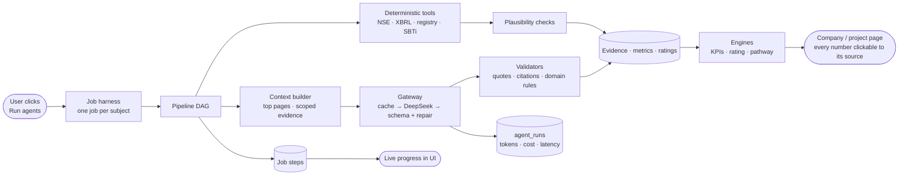

# Sylithe — Project Guide

> **Sylithe is an evidence-backed carbon intelligence platform.** It measures companies' climate performance from their
> own filings (BRSR, annual report, CSR), rates carbon projects across seven registries, tells each company how much it
> *should* emit and what it is missing, and suggests matching carbon projects — with every number traced to the page,
> XBRL tag or registry transaction it came from.

Last updated: 26 Sep 2026 · all figures below were produced by the running system on this date.

---

## Contents

1. [What Sylithe does](#1-what-sylithe-does)
2. [System architecture](#2-system-architecture)
3. [Data sources](#3-data-sources)
4. [How a company is analysed (BRSR · annual report · CSR)](#4-how-a-company-is-analysed)
5. [Company results — emissions, goals, what they lack](#5-company-results)
6. [How the AI agents work — orchestration](#6-how-the-ai-agents-work--orchestration)
7. [How we reduce cost](#7-how-we-reduce-cost)
8. [How we reduce latency (speed)](#8-how-we-reduce-latency-speed)
9. [Accuracy & anti-hallucination safeguards](#9-accuracy--anti-hallucination-safeguards)
10. [Known limitations & next steps](#10-known-limitations--next-steps)
11. [Running the project](#11-running-the-project)

---

## 1. What Sylithe does

| Module | For | What it produces |
|---|---|---|
| **Module 1 — Company Carbon Intelligence** | Sustainability, finance & ESG teams; investors | Scope 1/2/3, energy, water, waste, CSR & financial context, climate targets, climate-legal exposure, 15 KPIs, a company carbon rating, and an **emissions pathway** (emitting vs should-emit, gap, levers, matched carbon projects) |
| **Module 2 — Carbon Project Rating** | Credit buyers, investors, analysts | An explainable AAA–D rating across 11 dimensions for any of 11,659 registry projects, with anomaly detection and analyst review |
| **Research Agent** | Everyone | Natural-language answers over Sylithe's data, with clickable evidence citations |
| **Carbon Calculator** | Company users measuring *their own* footprint | Scope 1/2 from uploaded bills & invoices (the only place users upload anything) |

Public website: `/` (home), `/projects` (marketplace), `/ratings`, `/companies`, `/how-it-works`, `/about`.
Platform (after login): `/sylithe` — Overview, Company Intelligence, Carbon Calculator, Project Ratings, Compare, AI Research Agent, Methodology.

**Core principle — tools compute, the LLM interprets.** Numbers come from parsers, registries and formulas. The AI only reads
narrative text and explains; every AI claim must cite evidence that code can verify.

---

## 2. System architecture

```text
┌──────────────────────────── Frontend (React 19 + Vite + Tailwind + Recharts) ────────────────────────────┐
│  Public site (/ , /projects, /ratings …)          Platform (/sylithe/…)  — dashboards, tabs, evidence drawer │
└───────────────────────────────────────────────┬───────────────────────────────────────────────────────────┘
                                                │ REST (JWT auth)
┌───────────────────────────────────────────────▼───────────────────────────────────────────────────────────┐
│ Flask API                                                                                                  │
│  /api/companies  /api/intel/*  /api/research  /api/calculator  /api/overview  /api/jobs  /api/evidence     │
│                                                                                                            │
│  Orchestrators (background jobs)      Deterministic tools              AI gateway (services/ai.py)         │
│  ├ company research pipeline          ├ NSE resolver & filings         ├ DeepSeek T1 (deepseek-flash)      │
│  ├ project rating pipeline            ├ BRSR XBRL parser               ├ DeepSeek T2 (deepseek-v4-pro)     │
│  ├ registry / SBTi ingest             ├ PDF page parser + quote check  ├ JSON-schema validation + repair   │
│  └ research agent (tool loop)         ├ KPI / rating / pathway engines ├ content-addressed result cache    │
│                                       └ emission-factor calculator     └ cost & latency logging            │
└───────────────┬───────────────────────────────────┬───────────────────────────────────┬───────────────────┘
                │                                   │                                   │
        MongoDB (companies, metrics,        External public data                 DeepSeek API
        evidence, ratings, jobs,            NSE · OffsetsDB · Gold Standard ·
        agent_runs, ai_cache, caches)       SBTi dashboard · CEA · IPCC
```

Code map:

| Area | Backend (`sylithe-backend/`) | Frontend (`sylithe-frontend/src/`) |
|---|---|---|
| Company intelligence | `services/company_agents.py`, `brsr_xbrl.py`, `nse.py`, `company_rating.py`, `company_pathway.py`, `sbti.py`, `routes/companies.py` | `sylithe/pages/Companies.jsx`, `CompanyProfile.jsx`, `Pathway.jsx` |
| Project rating | `services/project_rating.py`, `offsetsdb.py`, `methodology_kb.py`, `routes/project_intel.py` | `sylithe/pages/Projects.jsx`, `ProjectDetail.jsx`, `Compare.jsx`; public `site/pages/*` |
| AI & evidence | `services/ai.py`, `evidence.py`, `documents.py`, `jobs.py` | `sylithe/ui.jsx` (evidence drawer, job progress) |
| Research agent | `routes/research.py` | `sylithe/pages/Research.jsx` |
| Calculator | `routes/calculator.py`, `services/emission_factors.py` | `sylithe/pages/Calculator.jsx` |

---

## 3. Data sources

| Source | What we take | How | Confidence |
|---|---|---|---|
| **NSE equity list** (`EQUITY_L.csv`) | 2,585 listed companies: symbol, name, ISIN | Company resolver (fuzzy match) | — |
| **NSE BRSR filings** (PDF + **XBRL**) | Scope 1/2/3, energy, water, waste, revenue, intensities, assurance | XBRL: deterministic parser. PDF: Carbon Narrative Agent | XBRL = **High**; PDF = High if the quote is found on the cited page |
| **NSE annual reports** (PDF) | Revenue, EBITDA, PAT, capex, **CSR spend**, environmental capex, legal/environmental matters | Financial & Litigation Agent | Same page-verification rule |
| **CarbonPlan OffsetsDB** | 11,659 projects + every issuance/retirement (Verra, Gold Standard, ACR, CAR, ART, Isometric, Cercarbono) | Weekly ingest, aggregated per project | High (registry data) |
| **Gold Standard public API** | Methodology version, estimated annual credits, crediting period, SDGs | Looked up per project (`query=GS{id}`, name-checked) | High |
| **SBTi Target Dashboard** | 15,703 companies, 28,831 targets: validated / committed / removed, target wording, base & target years | Weekly ingest, matched by **ISIN** | High |
| **CEA CO₂ Baseline Database V21.0** | Indian grid factor 0.710 tCO₂/MWh (FY2024-25) | Calculator | Cited |
| **IPCC 2006** | Fuel CO₂ factors & calorific values | Calculator | Cited |
| **Methodology research** | ICVCM decisions; peer-reviewed studies on cookstoves (Nature Sustainability 2024) and REDD+ (Science 2023) | Versioned knowledge base | Cited, applied as *Inference* |

Nobody uploads company or project documents — the agents fetch them. Uploads exist only in the Carbon Calculator, for a
company's own bills.

---

## 4. How a company is analysed

### 4.1 Pipeline

```text
NSE symbol ─► Company Resolver ─► Document Discovery ─► BRSR XBRL Parser ─► Carbon Narrative Agent ─► Financial & Litigation Agent ─► Engines
              (NSE list)          (BRSR PDF+XBRL,       (exact numbers,       (BRSR pages: targets,     (annual report: P&L, CSR,         KPIs · rating ·
                                   annual reports)       0 tokens)             credits, Scope 3, actions) legal & environmental matters)      pathway · SBTi
```

### 4.2 What is read from each document

| Document | Section | Extracted |
|---|---|---|
| **BRSR XBRL** | Principle 6 tagged facts | Scope 1, Scope 2, Scope 3 (when tagged), Scope 1+2 intensity per ₹ revenue, total & renewable energy, electricity, water withdrawal & consumption, waste generated & recovered, revenue, reporting boundary, GHG assurance provider |
| **BRSR PDF** | Principle 6 narrative, leadership indicators | Net-zero / reduction / renewable targets (base & target year, SBTi status), carbon-credit purchases/retirements, Scope 3 categories, concrete transition actions |
| **Annual report** | Financial statements, notes, CSR annexure, legal/contingent liabilities | Revenue, EBITDA, PAT, capex, environmental capex, **CSR spend**, legal & professional fees, environmental penalties/proceedings, explicitly climate-related litigation |
| **SBTi dashboard** | — | Commitment/validation status, near-term target wording, net-zero status |

**Legal-cost rule:** a legal expense is only ever counted as climate-related if the source explicitly says so; "legal and
professional fees" stays a plain P&L line.

### 4.3 What is computed

* **15 KPIs** — each with current value, previous period, change %, source, confidence and data state
  (Reported / Calculated / Data not found).
* **Company Carbon Rating v0.1 (A–E)** — 8 weighted dimensions: disclosure quality, emissions trajectory, carbon intensity
  trend, renewable transition, target credibility (SBTi status is authoritative), carbon-credit use, climate-legal exposure,
  data confidence. The grade is withheld if fewer than 5 dimensions can be scored.
* **Emissions Pathway v0.1** — *emitting vs should-emit*:
  * should emit = 1.5°C path, **−4.2 % of base-year Scope 1+2 per year** (SBTi absolute contraction approach), ≥90 % cut by 2050;
  * company target line (SBTi-validated target when base-year emissions are available, else the disclosed target);
  * gap, cut needed by 2030, reduction **levers** from the company's own data, and a **carbon suggestion** sized to the gap
    with matched registry projects (same country, removals first, flagged methodologies and grades below BBB excluded).
    Credits never count toward reduction targets — they are for residual emissions.

---

## 5. Company results

Four NSE-listed companies analysed end-to-end (latest filings: BRSR FY2025-26). tCO₂e unless stated.

### 5.1 Emissions & performance

| | Reliance Industries | TVS Motor | Tata Consultancy Services | Wipro |
|---|---:|---:|---:|---:|
| Sector | Oil to chemicals | Automobiles | IT services | IT services |
| Boundary | Standalone | Standalone | Consolidated | Consolidated |
| **Scope 1** | 36,350,070 (−0.3 %) | 23,151 (+14.1 %) | 22,631 (+10.4 %) | 7,649 (−4.9 %) |
| **Scope 2** | 1,918,352 (+30.5 %) | 625 (−78.9 %) | 53,971 (−2.9 %) | 8,075 (−65.5 %) |
| **Scope 3** | not disclosed | not disclosed | 573,872 (+9.6 %) | 170,928 (−9.2 %) |
| **Scope 1+2** | **38,268,422 (+0.9 %)** | **23,776 (+2.2 %)** | **76,602 (+0.7 %)** | **15,724 (−50.0 %)** |
| Intensity (tCO₂e / ₹ crore) | 70.0 (+2.8 %) | 0.50 | 0.29 (−3.7 %) | 0.17 (−51.8 %) |
| Renewable share of energy | 1.1 % | 97.1 % | 79.0 % | see note ¹ |
| Waste recovered | 97.7 % | 86.0 % (FY24-25) | 76.4 % | 88.3 % |
| **CSR spend (FY2025-26)** | ₹1,223 cr | ₹56.4 cr | ₹1,017 cr | ₹227.4 cr |
| Environmental capex | not disclosed | ₹553.5 cr | not disclosed | ₹10.5 cr |
| **Sylithe rating** | **C** (55.7) | **B** (66.7) | **B** (77.8) | **A** (96.0) |

¹ Wipro's and TCS's XBRL energy totals failed Sylithe's energy-vs-emissions consistency check (the values imply MJ entered
as GJ, ~1,000× too large). They are excluded from KPIs and flagged as filing issues; TCS's energy figure comes from its
BRSR PDF instead. Wipro's BRSR states that 94 % of its *electricity* is renewable.

### 5.2 Goals, pathway & what each company lacks

#### Reliance Industries — Rating C · 1.93 Mt above the 1.5°C path
* **Goals disclosed:** Net Carbon Zero by 2035; 100 GW of renewable-energy capacity by 2030; 500+ compressed-biogas plants by 2030.
* **Pathway:** emitting 38.27 Mt vs 36.34 Mt on the 1.5°C path in FY2025-26 → **gap 1.93 Mt**; needs an 8.3 Mt cut by 2030
  (~5.4 % of today's emissions per year).
* **What it lacks:** not on the SBTi dashboard; no base year or quantified value behind the 2035 net-zero goal; Scope 3 not
  disclosed; renewables only 1.1 % of energy; Scope 2 up 30.5 % year-on-year; no carbon-credit, environmental-capex or
  climate-litigation disclosure.
* **Suggested levers:** commit to SBTi → raise renewable share → fuel switching & process efficiency (Scope 1 is 95 % of
  Scope 1+2) → interim absolute target with base year → measure Scope 3.
* **Carbon suggestion:** 1.93 Mt residual/gap coverage, matched to Indian removal projects (e.g. VCS3115 sustainable
  agriculture, VCS1328 Araku Valley agroforestry, VCS1463 Sundarbans mangrove restoration) — to be rated before purchase.

#### TVS Motor — Rating B · 1,500 t above path
* **Goals disclosed:** a commitment to reduce GHG "in line with climate science" — no quantified target, base or target year.
* **Strengths:** 97.1 % renewable energy (up from 54.6 %); Scope 2 down 79 %; ₹553 cr environmental capex.
* **What it lacks:** **SBTi commitment removed (expired)**; Scope 1 up 14.1 %; no Scope 3; XBRL intensity figures failed
  plausibility checks (a unit error in the filing), so intensity comes from the PDF.
* **Levers:** renew SBTi commitment → fuel switching in direct operations → dated base-year target → Scope 3.

#### Tata Consultancy Services — Rating B · 3,704 t above path
* **Goals:** **SBTi-validated (1.5°C):** −90 % absolute Scope 1+2 by FY2030 from FY2016; −35 % Scope 3 by FY2034 from FY2020;
  Zero Waste to Landfill by 2030.
* **Strengths:** full disclosure incl. Scope 3; intensity −3.7 %; 79 % renewables; waste recovery up to 76 %.
* **What it lacks:** Scope 1+2 still rising (+0.7 %), Scope 1 +10.4 %; FY2016 base-year emissions aren't in the filings
  Sylithe reads, so progress to the 90 % target can't be drawn in tonnes; SBTi net-zero commitment shows as removed;
  energy total in XBRL failed the consistency check.
* **Lever:** interim absolute-reduction tracking against the validated base year.

#### Wipro — Rating A · 14,416 t *below* the 1.5°C path (on track)
* **Goals:** **SBTi-validated:** −59 % Scope 1+2 by FY2030 (FY2017 base); −55 % Scope 3 by 2030; net zero by FY2040
  (validated); 100 % renewable energy for owned facilities by 2030; water targets (45 % treated water, −3 %/yr freshwater,
  zero untreated discharge).
* **Performance:** Scope 1+2 halved year-on-year (−50 %), Scope 3 −9.2 %, waste recovery 88 %.
* **What it lacks:** base-year (FY2017) tonnes not in the filings read; XBRL energy failed the consistency check (renewable
  share therefore not computed); some financials only in USD/INR million.
* **Carbon suggestion:** on track — sized to residual emissions at net zero (~3,146 t).

---

## 6. How the AI agents work — orchestration

### 6.1 Design principles

1. **Workflow, not a free-roaming agent.** Each pipeline is a fixed, code-controlled DAG; the LLM is called only at
   defined nodes. Cost, latency and behaviour are predictable. The only open tool loop is the Research Agent, and it can
   only call Sylithe's own read-only tools.
2. **Small agents, small contexts.** Every agent gets only the pages or facts it needs.
3. **Tools compute, LLMs interpret.** Numbers come from XBRL, registries and formulas.
4. **Evidence or it didn't happen.** Code validates every citation before anything is stored.
5. **Everything logged.** Every call writes model, tokens, cache hit, latency and cost to `agent_runs`.

### 6.2 The orchestrator (job runner)

```text
POST /api/companies/research {symbol}        POST /api/intel/projects/:id/rate
        │                                                │
        ▼                                                ▼
 start_job(kind, subject)  ── unique index "one running job per subject" (double clicks attach to the same job)
        │
        ▼  background thread
 pipeline(job) ── job.step(key, label, status, detail) ──► Mongo `jobs` ──► UI polls /api/jobs/:id every 2.5 s
        │                                                                   (live step list + running cost)
        └── each agent call → AI gateway → cache? → DeepSeek → schema validation → evidence validation → store
```

* Jobs survive in MongoDB, so any server worker can answer polling; stalled jobs (no update for 20 min) are marked failed.
* Downloads have a hard 180 s deadline; parsed PDF text is cached by URL so re-runs never re-download.

### 6.3 Module 1 — company research DAG

| # | Node | Type | Model | Input → Output |
|---|---|---|---|---|
| 1 | Company Resolver | code | — | name/symbol → NSE listing (ISIN) |
| 2 | Document Discovery | code | — | NSE APIs → BRSR PDF, BRSR XBRL, annual reports |
| 3 | BRSR XBRL Parser | code | — | XBRL → ~28–30 exact facts (+ plausibility checks) |
| 4 | Carbon Narrative Agent | LLM | T1 | 16 most relevant BRSR pages → targets, credits, Scope 3, transition actions (page-cited) |
| 5 | Financial & Litigation Agent | LLM | T1 | 18 most relevant annual-report pages → P&L, CSR, legal/environmental matters |
| 6 | Quote verification | code | — | every quote checked against the cited page (±1) |
| 7 | KPI · rating · pathway · SBTi | code | — | 15 KPIs, rating A–E, emitting-vs-should-emit, levers, matched projects |

Only **2 LLM calls** per company.

### 6.4 Module 2 — project rating DAG

```text
Stage 1  GATHER (code, no LLM)      registry facts · Gold Standard record · developer portfolio · methodology KB · linked PDFs
Stage 2  ANOMALY (code)             issuance spikes · vintage concentration · late issuance · issuance vs estimate · status
Stage 3  ASSESS (10 agents, T1, parallel)
         additionality · baseline · permanence · leakage · monitoring · verification · developer ·
         methodology · transparency · co-benefits          (each sees ONLY its relevant evidence items)
Stage 4  VALIDATE (code)            drop citations to evidence the agent was not given; set confidence by evidence kind
Stage 5  SCORE (code)               weighted rubric v0.1 → base grade (permanence weight 0 where no stored carbon)
Stage 6  ADJUDICATE (T2, 1 call)    may move the grade ±1 notch with a written reason; writes the summary & key risks
```

### 6.5 Research Agent — tool loop

The Research Agent (T1) answers questions by calling six read-only tools — `search_companies`, `get_company` (incl.
pathway), `rank_companies`, `search_projects`, `get_project`, `get_evidence` — at most 8 steps. Answers cite
`[ev_…]` evidence ids; the server checks every cited id exists and flags any that don't. Session history gives follow-up
context. The UI reveals the answer word by word.

### 6.6 Agent contract (every LLM node)

```json
{ "score": 0-100 | null, "risk": "low|medium|high|unknown", "reason": "≤3 sentences",
  "evidence": [{"evidence_id": "ev_…", "supports": "…"}], "data_gaps": ["…"],
  "label": "Reported|Calculated|Inference|Model estimate|Data not found", "reasoning_summary": "…" }
```

### 6.7 The agent harness — end-to-end flow

The harness wraps every agent: orchestration, context building, the model gateway, validation, caching, telemetry and
failure handling. Full specification (with every agent's verbatim system prompt, schemas, limits and failure
handling): [`architecture/AGENT_HARNESS.md`](architecture/AGENT_HARNESS.md).



| Harness component | What it does | Key settings |
|---|---|---|
| Job harness | Runs pipelines in the background, records each step and cost, dedupes triggers, expires stalled jobs | unique running job per subject · 20 min stale timeout |
| Context builder | Chooses the pages / evidence each agent sees | 16 BRSR pages · 18 annual-report pages · ~1k tokens per dimension agent |
| Model gateway | One entry point for every LLM call | T1 flash / T2 pro · effort low · 180 s × 3 attempts · 1 repair turn |
| Result cache | Content-addressed; identical input → stored output | key = agent + prompt version + model + input |
| Validators | Schema, quote-on-page, citation scope, legal-cost rule, Scope 2 basis | failing items → Low confidence or dropped |
| Plausibility checks | Catch unit errors in company filings | revenue, intensities, energy vs emissions, Scope 3 = 0, waste |
| Telemetry | Logs every call | tokens, cached tokens, reasoning tokens, latency, cost, errors |
| Research tool loop | Read-only tools, cited answers | ≤ 8 steps · 12-turn memory |

---

## 7. How we reduce cost

**Measured cost (this deployment):**

| Job | Typical AI cost |
|---|---|
| Full company research (2 LLM agents) | **$0.009 – $0.015** |
| Full project rating (10 agents + adjudicator) | **$0.007 – $0.017** |
| Research-agent answer (tool loop) | **≈ $0.002** |
| Re-running an unchanged job | **$0.00** (cache) |

Per agent (median, cache misses): Carbon Narrative $0.0054 (≈24k tokens in) · Financial & Litigation $0.0053 (≈22k in) ·
each dimension agent $0.0003–0.0007 (≈0.8–1k in) · adjudicator $0.004.

**Levers, in order of impact:**

| # | Lever | Effect |
|---|---|---|
| 1 | **No LLM where code can answer** — XBRL parser for all core climate numbers; registry maths for issuance; formulas for KPIs, rating, pathway | ~30 exact facts per company for **0 tokens** |
| 2 | **Page selection, not whole documents** — keyword-scored top 16–18 pages per agent | ~22–24k tokens instead of ~150k+ for a 187-page annual report (**~85 % fewer input tokens**) |
| 3 | **Tiered models** — T1 `deepseek-flash` for extraction/dimensions/research; T2 `deepseek-v4-pro` only for the single adjudication | Reasoning-model price paid once per rating |
| 4 | **Tiny per-dimension contexts** — each project agent sees only its evidence (~1k tokens) | 10 agents cost less than one whole-document call |
| 5 | **Content-addressed result cache** — key = agent + prompt version + model + exact input | Identical re-runs cost $0 and return instantly |
| 6 | **Methodology-level reuse** — cited methodology findings computed once, reused by every project using that methodology | No per-project research of the same methodology |
| 7 | **Parsed-document cache** — PDF text cached by URL | No re-download or re-parse |
| 8 | **Low reasoning effort + strict JSON schema, one repair retry** | Fewer output tokens; failures don't loop |
| 9 | **Off-peak awareness** — DeepSeek peak windows (weekdays 01–04 & 06–10 UTC) cost 2×; cost is logged per call so batch jobs can be scheduled off-peak | Up to 50 % on bulk runs |
| 10 | **Telemetry** — every call logged (`agent_runs`); overview shows total spend & cache hits | Spend is visible and auditable |

**At scale (LLM cost only, measured averages):** 1,000 companies ≈ **$12** · all 11,659 registry projects rated ≈ **$120**.

---

## 8. How we reduce latency (speed)

**Measured wall-clock time:**

| Job | Time |
|---|---|
| Full company research (download + parse + 2 agents + engines) | **43 – 75 s** |
| Project rating (10 agents + adjudicator) | **12 – 62 s** |
| Research-agent answer | **≈ 8 s** median |
| Cached re-run | **< 1 s** |

**Techniques:**

| # | Technique | Effect |
|---|---|---|
| 1 | **Parallel fan-out** — the 10 project dimension agents run concurrently (thread pool) | Latency ≈ slowest agent (~5–8 s), not the sum (~50 s) |
| 2 | **Deterministic steps first** — resolver, discovery, XBRL parse take seconds and stream to the UI immediately | Useful results appear before any LLM finishes |
| 3 | **Background jobs + live progress** — HTTP returns a job id instantly; the UI polls and shows each step as it completes | No request timeouts; user sees work happening |
| 4 | **Small prompts** — page selection and per-dimension evidence keep inputs small | Faster time-to-first-token and generation |
| 5 | **Caches** — AI result cache, parsed-PDF cache, SBTi/registry data cached weekly, NSE list cached 7 days | Repeat views and re-runs are instant |
| 6 | **Hard deadlines** — 180 s per download, request timeouts + retries with back-off on the LLM | A slow source can't stall a job indefinitely |
| 7 | **One job per subject** — duplicate clicks attach to the running job | No duplicated work competing for the same resources |
| 8 | **Progressive rendering** — research answers type out word-by-word; charts render without animation delay | Faster perceived response |

---

## 9. Accuracy & anti-hallucination safeguards

* **Quote verification** — every AI-extracted value carries a verbatim quote; code finds it on the cited page (±1).
  Unverified → Low confidence.
* **Citation validation** — agents may only cite evidence ids they were given; anything else is removed and counted.
* **Filing plausibility checks** (real problems found in live filings):
  * revenue tagged in crores in an INR field (TVS Motor) → rejected;
  * per-rupee intensities ~10 million× too large (TVS Motor) → rejected, PDF value used;
  * energy totals inconsistent with Scope 1+2, i.e. MJ entered as GJ (TCS, Wipro) → excluded;
  * Scope 3 tagged 0 → treated as not disclosed; waste recovered > generated → ratio not computed.
* **One Scope 2 basis per series** — location- and market-based values are never mixed across years.
* **Legal-cost guard** — no climate attribution without explicit source text.
* **Versioning** — every rating stores methodology, prompt, knowledge-base and model versions; history is never rewritten.
* **Human review** — analysts can override any project dimension with a reason; the AI assessment is kept.
* **Untrusted-document rule** — documents are passed as data blocks; embedded instructions are ignored.

---

## 10. Known limitations & next steps

* Company coverage is NSE-listed companies (BSE blocks scripted access; there is no web search by design).
* Project PDDs/monitoring reports aren't fetched automatically (registry document portals need a browser session);
  analysts can link public PDFs. Ratings without documents are marked *provisional*.
* Pathway uses the earliest disclosed year as base (often one year back) and covers Scope 1+2 only.
* No sector benchmarks yet for intensity levels.
* Scanned (image-only) PDFs need OCR.
* Before production: confirm NSE, registry and SBTi data terms; move secrets to a vault; add rate limits per user.

---

## 11. Running the project

```bash
# Backend
cd sylithe-backend
python3 -m venv .venv && .venv/bin/pip install -r requirements.txt
# .env → MONGO_URI, JWT_SECRET, DEEPSEEK_API_KEY  (see .env.example)
.venv/bin/python app.py                                   # http://localhost:5001

# Frontend
cd sylithe-frontend && npm install
VITE_API_URL=http://localhost:5001 npm run dev            # http://localhost:5173
```

First run: log in as an admin → **Project Ratings → Load registry data** (OffsetsDB). SBTi data loads automatically on
the first company analysis. Then research any NSE company from **Company Intelligence**.

Related documents: `methodology/COMPANY_CARBON_RATING.md`, `methodology/PROJECT_RATING.md`,
`architecture/AGENT_HARNESS.md`, `architecture/AI_AGENT_ARCHITECTURE.md`, `architecture/IMPLEMENTATION_M1_M2.md`.
